# EcoStep Carbon Calculator & Dashboard


## Competition Participation & Team

This project was developed during **PYSPHERE 2026**, a university-level programming competition organized by the IT Club of UoS, focusing on innovation and applied problem-solving.

- **Team Name:** Tech Team  
- **Event Date:** February 2026


## Table of Contents

- [Introduction](#introduction)
- [Objectives](#objectives)
- [Key Features](#key-features)
  - [1. Transport emissions calculator](#1-transport-emissions-calculator)
  - [2. Electricity usage calculator](#2-electricity-usage-calculator)
  - [3. Diet impact estimator](#3-diet-impact-estimator)
  - [4. Daily and monthly summary](#4-daily-and-monthly-summary)
  - [5. Impact Classification Function](#5-impact-classification-function)
  - [6. Contextual equivalents](#6-contextual-equivalents)
  - [7. Smart suggestions](#7-smart-suggestions)
  - [8. Data Visualization Section](#8-data-visualization-section)
- [Screenshots](#screenshots)
  - [1. Main dashboard interface](#1-main-dashboard-interface)
  - [2. Sidebar](#2-sidebar)
  - [3. Data Input Section](#3-data-input-section)
  - [4. Result Section](#4-result-section)
  - [5. Visualization Section](#5-visualization-section)
  - [6. Smart Suggestion Section](#6-smart-suggestion-section)
  - [7. Export Section](#7-export-section)
- [Resources and Tools Used](#resources-and-tools-used)
- [How to Run the App](#how-to-run-the-app)
  - [1 Clone the Repository](#1-clone-the-repository)
  - [2️ (Optional but Recommended) Create a Virtual Environment](#2️-optional-but-recommended-create-a-virtual-environment)
  - [3️ Install Dependencies](#3️-install-dependencies)
  - [4️ Run the Application](#4️-run-the-application)
  - [5️ Open in Browser](#5️-open-in-browser)

---

## Introduction
The EcoStep Carbon Calculator is a Python-based web application that helps users understand and track their daily carbon footprint interactively. It focuses on transportation, household electricity use, and diet. The app converts emissions into relatable comparisons, such as trees required to offset them, smartphone charges, or kilometers driven in a petrol car.

---

## Objectives

- Provide users with an easy tool to estimate daily and monthly carbon emissions.
- Increase awareness of how transport, electricity use, and diet contribute to an individual's footprint.
- Translate abstract emission numbers into relatable equivalents that motivate behaviour change.
- Offer simple, personalized tips to help users reduce overall emissions.

---

## Key Features

### <span style="color:teal; font-weight:bold;">1. Transport emissions calculator</span>

Users select fuel type (petrol or diesel) and enter liters used; the app calculates emissions.

__Fuel Emission Factors:__

- Petrol = 2.06916 kg CO₂ per liter  
- Diesel = 2.57082 kg CO₂ per liter

__Formula:__  
`CO₂` = `Litres per day * Emission factor`

- None (EV / Walk / Cycle) → `CO₂` = `0`

### <span style="color:teal; font-weight:bold;">2. Electricity usage calculator</span>

Users input daily usage hours for AC, TV, laptop, and LED lights; the app converts this into kWh and then into kg CO₂e.

__UK Average Grid Factor (2025):__ 0.43 kg CO₂ per kWh

__Appliance Power Ratings:__

<div align="center">

| Appliance | Power (kW) |
| --------- | ---------- |
| AC        | 1.50       |
| TV (LED)  | 0.10       |
| Laptop    | 0.05       |
| LED Light | 0.01       |

</div>

__Calculation:__  
- `Energy(kWh)` = `Hours × Power`  
- `Total Electricity(kWh)` = `sum(Energy of all appliances)`  
- `CO₂` = `Total Electricity × 0.43`  


### <span style="color:teal; font-weight:bold;">3. Diet impact estimator</span>

Users choose between high meat, mixed, or vegetarian/vegan diet patterns.  

<div align="center">

| Diet Type        | CO₂ per Day (kg) |
| ---------------- | ---------------- |
| High Meat        | 8.0              |
| Mixed            | 4.0              |
| Vegetarian/Vegan | 1.5              |

</div>

__Total carbon footprint:__  
`Total CO₂ = Transport + Electricity + Diet`

### <span style="color:teal; font-weight:bold;">4. Daily and monthly summary</span>

Aggregates emissions and shows total daily and projected monthly footprint.  
`Monthly CO₂ = Daily Total × 30`

### <span style="color:teal; font-weight:bold;">5. Impact Classification Function</span>

<div align="center">

| Total Daily Emission (kg) | Impact Level             |
| :-----------------------: | ------------------------ |
|           < 12            | Low (Excellent)          |
|           12–50           | Moderate (Good)          |
|           > 50            | High (Needs Improvement) |

</div>

### <span style="color:teal; font-weight:bold;">6. Contextual equivalents</span>

- __Trees Required:__ One mature tree absorbs ~0.057 kg CO₂/day  
  `Trees = Total CO₂ / 0.057`

- __Smartphone Charging Equivalent:__ One full phone charge emits 0.008 kg CO₂  
  `Phone Charges = Total CO₂ / 0.008`

- __Driving Distance Equivalent:__ Petrol car emits 0.170 kg CO₂/km  
  `Driving Distance = Total CO₂ / 0.170`

### <span style="color:teal; font-weight:bold;">7. Smart suggestions</span>

Identifies the highest impact category:  
`Dominant = max(Transport, Electricity, Diet)`

### <span style="color:teal; font-weight:bold;">8. Data Visualization Section</span>

- __Pie Chart:__ Percentage contribution of Transport, Electricity, Diet  
- __Bar Chart:__ Actual emission values (kg CO₂e) for each category

<span style="color:teal; font-weight:bold;">9. Export Section</span>

- __CSV Export:__ Transport, Electricity, Diet, Total Emissions  
- __Markdown Report Export:__ Date, Daily Total, Monthly Projection, Impact Level, Full Breakdown

---

## Screenshots

### 1. Main dashboard interface

<div align="center">

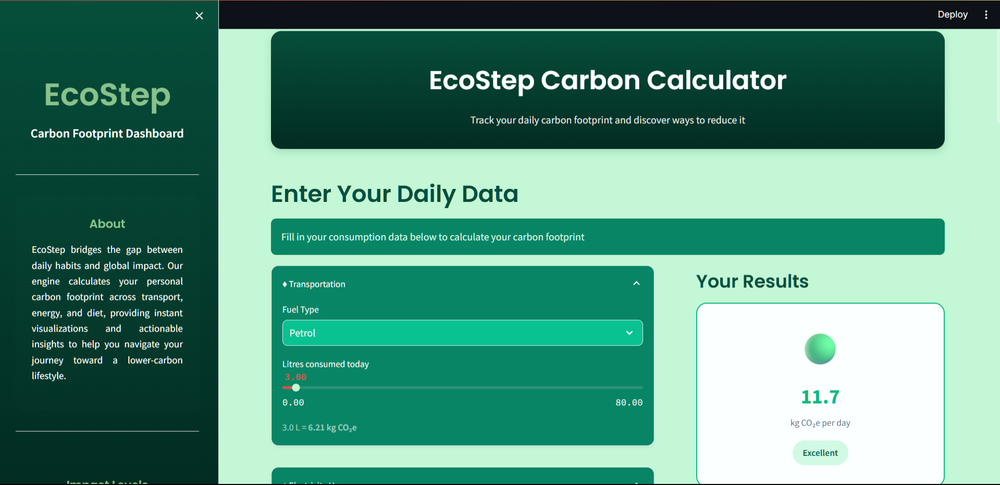

__Fig.1:__ Main dashboard interface
</div>

### 2. Sidebar

<div align="center">

<table>
<tr>
  <td>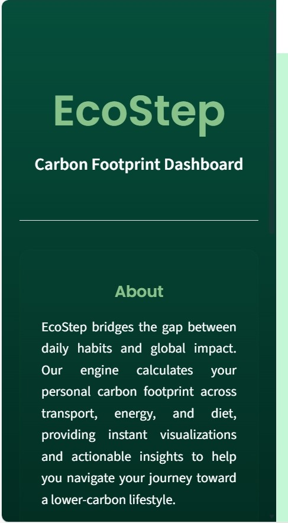<br><b>Fig.2:</b> About section</td>
  <td>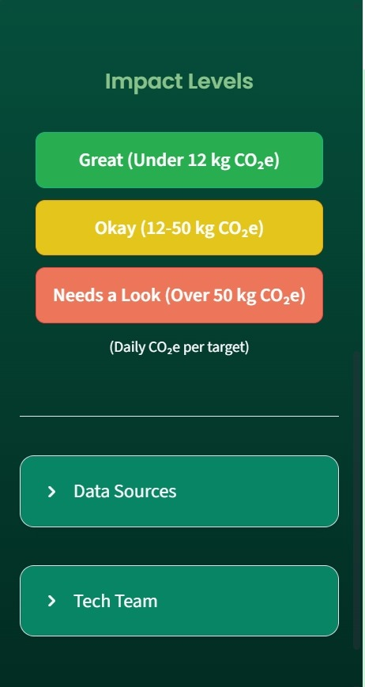<br><b>Fig.3:</b> Info about scores</td>
</tr>
<tr>
  <td>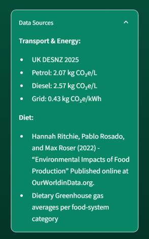<br><b>Fig.4:</b> Data resources</td>
  <td>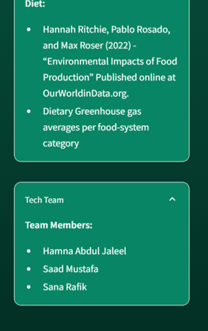<br><b>Fig.5:</b> Team members</td>
</tr>
</table>

</div>

### 3. Data Input Section

<div align="center">

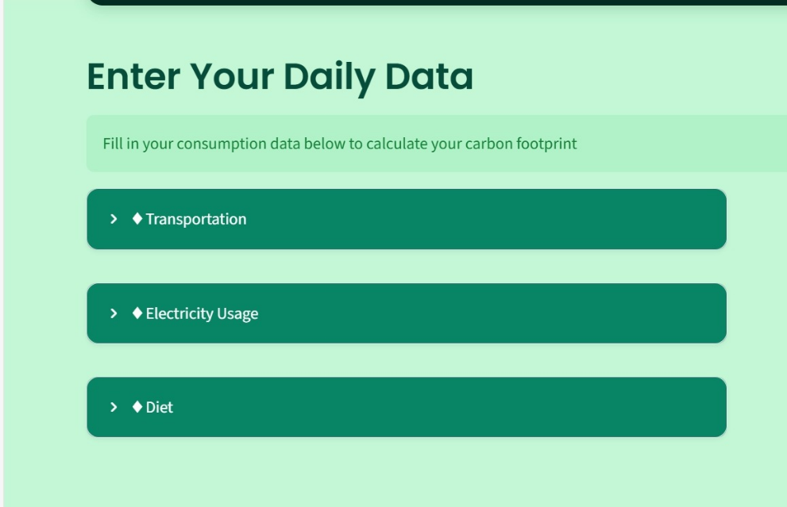<br>
__Fig.6:__ Data input area

<table>
  <tr>
    <td>
      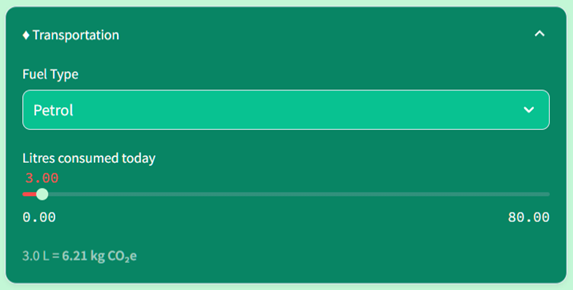<br>
      Fig.7: Transportation emission calculation interface
    </td>
    <td>
      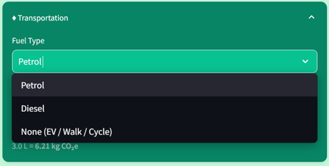<br>
      Fig.8: Options under fuel type
    </td>
  </tr>
</table>

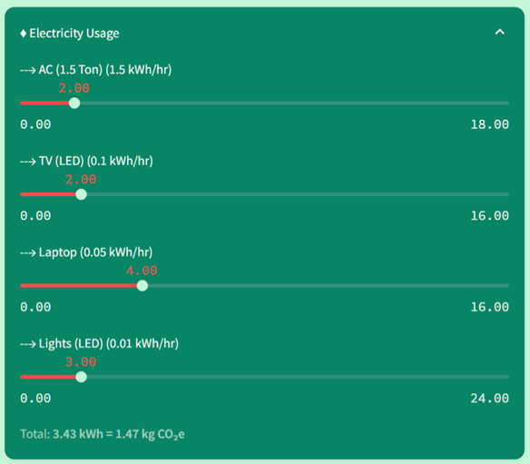<br>
__Fig.9:__ Electricity usage and emission calculation interface

<table>
<tr>
  <td>
    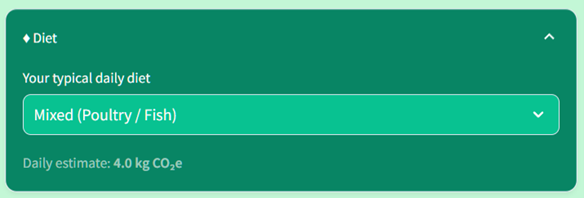<br>
    __Fig.10:__ Diet emission calculation interface
  </td>
  <td>
    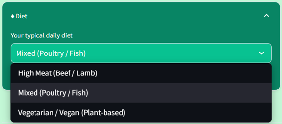<br>
    __Fig.11:__ Options under diet
  </td>
</tr>
</table>

</div>


### 4. Result Section

<div align="center">

<table>
<tr>
  <td>
    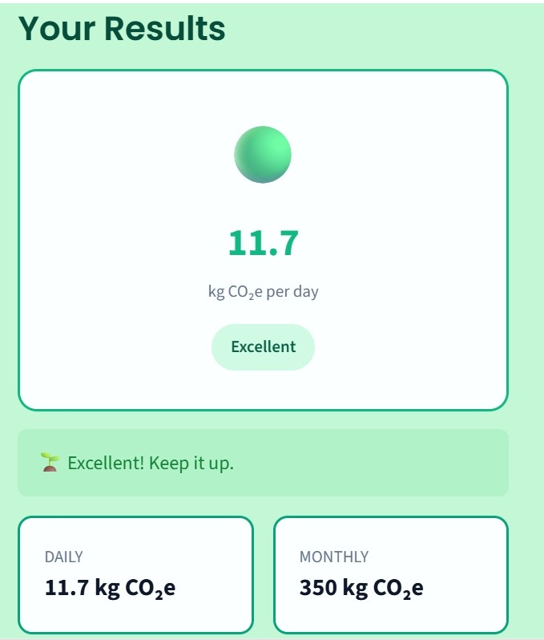<br>
    Fig.12: Low emission result
  </td>
  <td>
    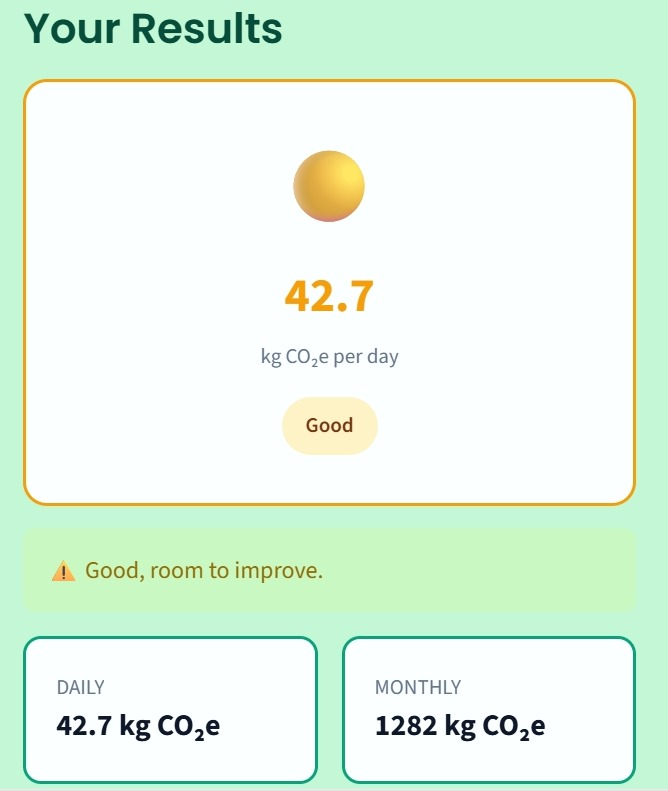<br>
    Fig.13: Moderate emission result
  </td>
  <td>
    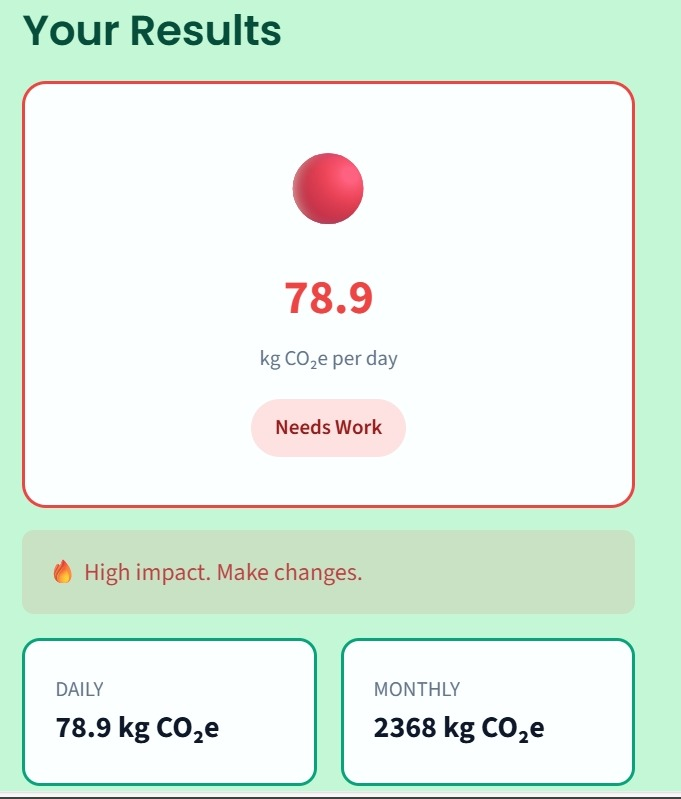<br>
    Fig.14: High emission result
  </td>
</tr>
</table>
</div>

### 5. Visualization Section

<div align="center">

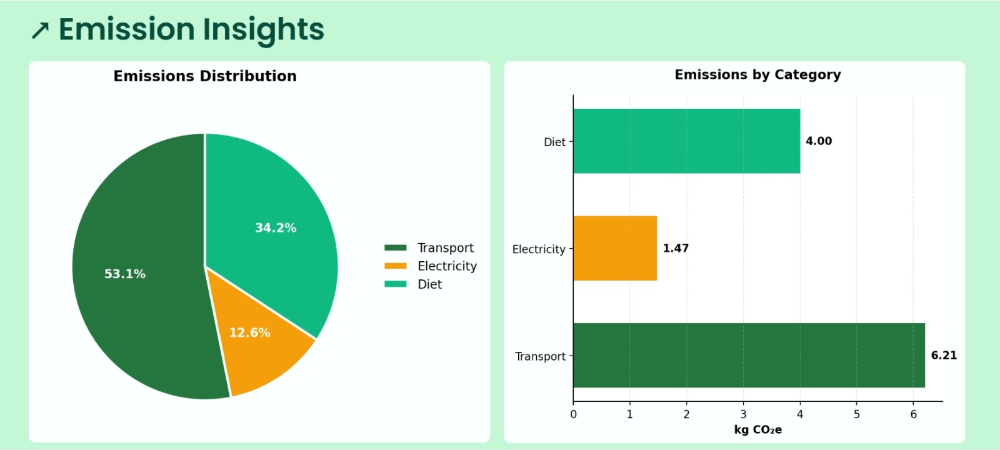<br>
__Fig.15:__ Emission distribution and category comparison charts

</div>

### 6. Smart Suggestion Section

<div align="center">

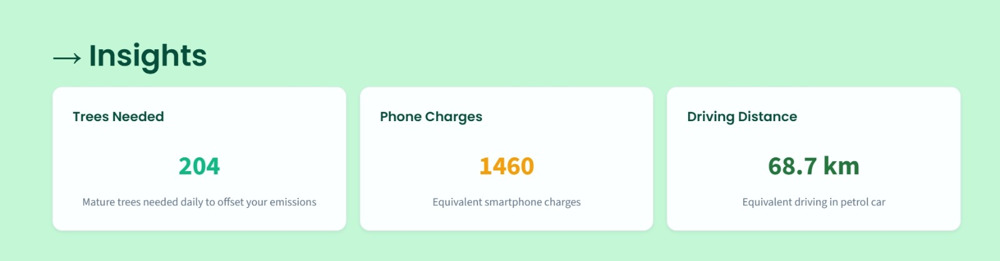<br>
__Fig.16:__ Environmental impact interpretation

<br>
__Fig.17:__ Personalized sustainability suggestions

</div>

### 7. Export Section

<div align="center">

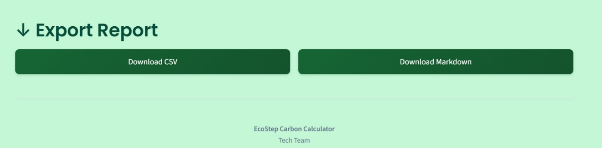<br>
__Fig.18:__ Export functionality for downloading carbon report

</div>

---

## Resources and Tools Used

- __Programming language:__ Python  
- __UI framework:__ Streamlit  
- __Libraries:__ Pandas, Matplotlib, datetime  
- __Data sources:__
  - [AC power consumption](https://www.bajajfinserv.in/what-is-the-power-consumption-of-1-5-ton-ac)
  - [Appliance energy use](https://smarterbusiness.co.uk/blogs/how-much-energy-do-my-appliances-use-infographic/)
  - [UK GHG conversion factors 2025](https://www.gov.uk/government/publications/greenhouse-gas-reporting-conversion-factors-2025)
  - [Diet emissions data](https://ourworldindata.org/environmental-impacts-of-food)  
- __Development environment:__ VS Code

---

## How to Run the App

### 1 Clone the Repository

```bash
git clone https://github.com/saadsirajulmustafa/EcoStep-Carbon-Calculator-Dashboard.git
cd EcoStep-Carbon-Calculator-Dashboard
```

---

### 2️ (Optional but Recommended) Create a Virtual Environment

```bash
python -m venv venv
```

Activate it:

**Windows**

```bash
venv\Scripts\activate
```

**Mac/Linux**

```bash
source venv/bin/activate
```

---

### 3️ Install Dependencies

```bash
pip install -r requirements.txt
```

---

### 4️ Run the Application

```bash
streamlit run app.py
```

---

### 5️ Open in Browser

After running the command, Streamlit will automatically open in your browser.

If it doesn’t, open:

```
http://localhost:8501
```