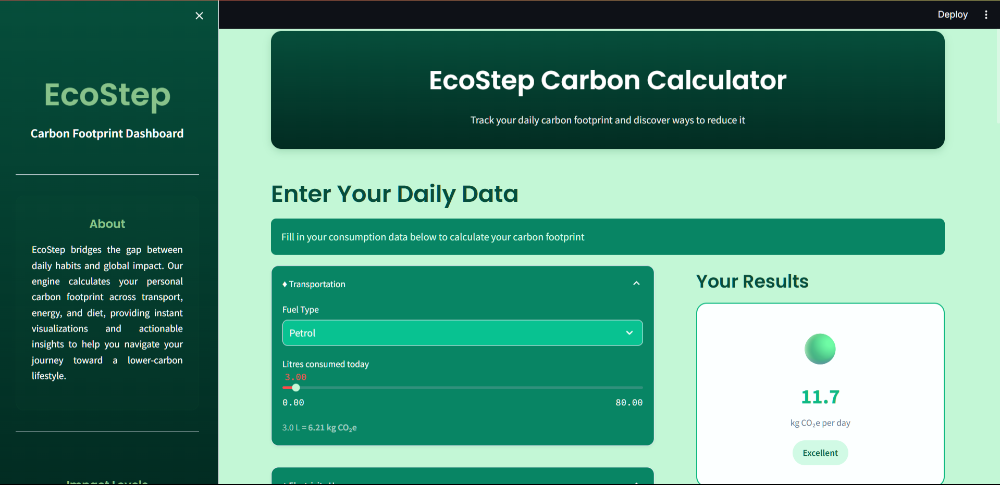
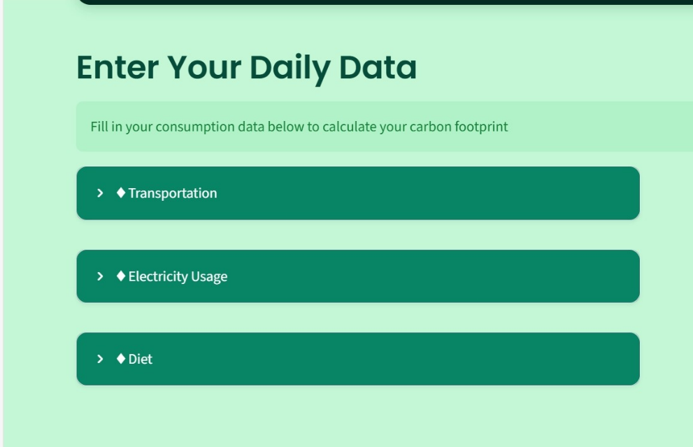
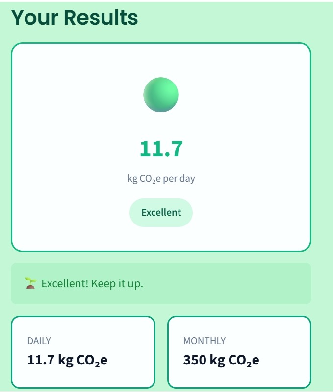
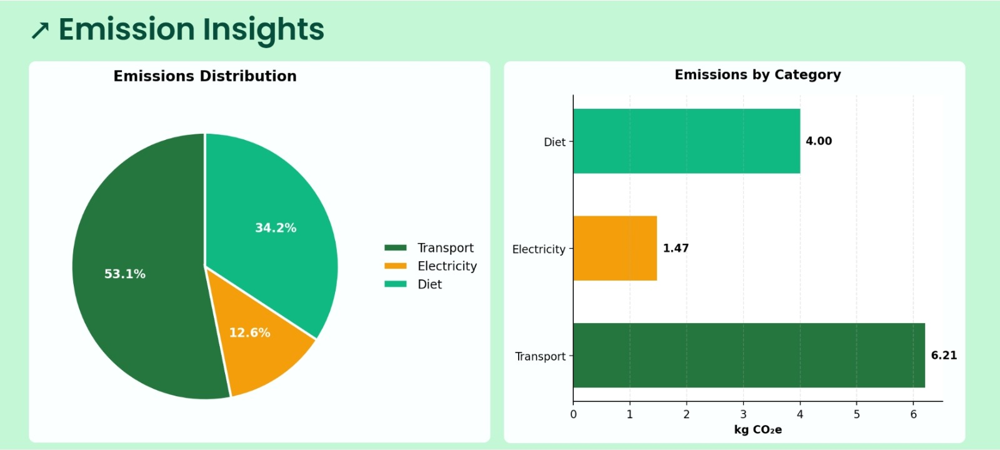
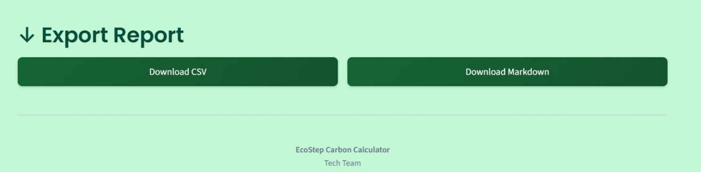

# EcoStep Carbon Calculator & Dashboard

EcoStep is a Streamlit-based web application that helps users understand and track their daily carbon footprint in a simple and interactive way. It focuses on three main areas: transport, electricity usage, and diet, translating emissions into easy-to-understand comparisons like trees required or driving distance.

This project was developed as part of **PYSPHERE 2026**, a university programming competition focused on applied problem-solving and innovation. It was a team effort, with different members contributing at various stages including development, improvements, and refinements.

---

## Key Features

- Calculates carbon emissions from transport, electricity usage, and diet
- Combines all sources into daily and monthly footprint summaries
- Classifies impact level (Low, Moderate, High) based on total emissions
- Converts emissions into relatable equivalents (trees, phone charges, driving distance)
- Provides simple suggestions based on the highest emission source
- Interactive visualizations using charts for better understanding
- Export option for saving results as reports

---

## Tech Stack Used

   

---

## Screenshots

<p align="center">
  
  <br><b>Dashboard Overview</b>
</p>

<p align="center">
  
  <br><b>Data Input Interface</b>
</p>

<p align="center">
  
  <br><b>Results & Classification</b>
</p>

<p align="center">
  
  <br><b>Visual Analytics</b>
</p>

<p align="center">
  
  <br><b>Suggestions & Insights</b>
</p>

<p align="center">
  
  <br><b>Export Feature</b>
</p>

---

## How to Run

1. Clone the repository  
2. Install dependencies  
3. Run the app using Streamlit  

```bash
git clone https://github.com/saadsirajulmustafa/EcoStep-Carbon-Calculator-Dashboard.git
```
```bash
cd EcoStep-Carbon-Calculator-Dashboard
```
```bash
pip install -r requirements.txt
```
```bash
streamlit run app.py
```
Open in browser: [http://localhost:8501](http://localhost:8501)
